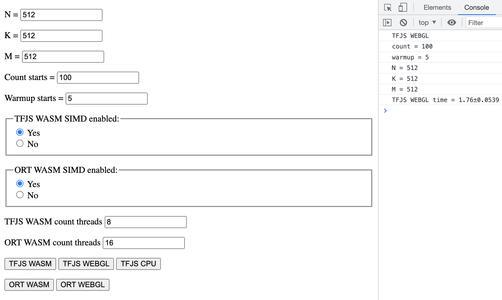

# Browser benchmarks

### You can run tests on your device on [this](https://cupertank.github.io/browser-benchmarks/) page

## Local starting

### Installation dependencies

For installation dependencies run in project root

```
npm i
```

### Run

For start project local run in project root

```
npm run start
```

### Usage

To run a benchmark:
1. Set the parameters on the page
2. Click on the button of the corresponding benchmark
3. Open browser console
4. After running the benchmark, the results will be in the console

### Example

