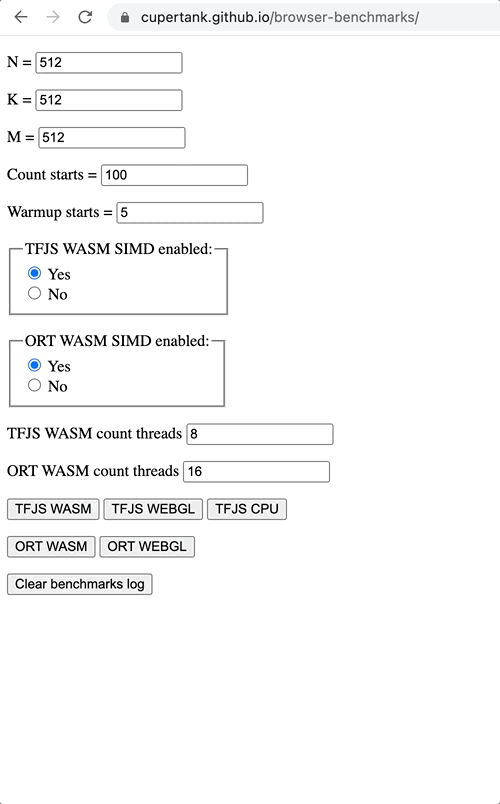

# Browser benchmarks

In this project,
you can compare the speed of matrix multiplication
(multiplication of an N x K matrix by K x M) in the TFJS and ONNXRuntime Web libraries.

Each benchmark is first run *Warmup* times, and then the mean time and spread over *Count* runs are measured.

### You can run benchmarks on your device on [this](https://cupertank.github.io/browser-benchmarks/) page

## Usage

To run a benchmark:
1. Set the parameters on the page
2. Click on the button of the corresponding benchmark
3. After running the benchmark, results will be at the bottom of the page

## Example


## Local starting

### Installation dependencies

For installation dependencies run in project root

```
npm i
```

### Run

For start project local run in project root

```
npm run start
```
